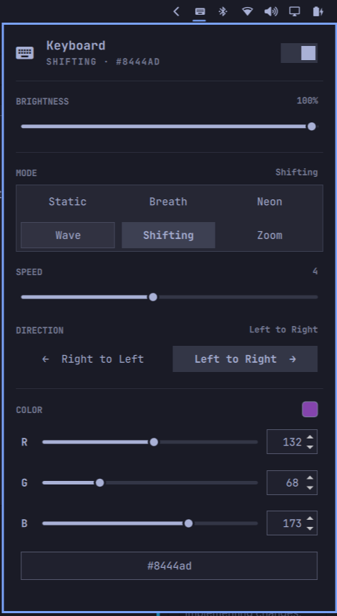

# Acer Keyboard RGB

An [omarchy](https://omarchy.org) status-bar widget that controls the Acer
keyboard backlight — brightness (0–100), RGB color (0–255 per channel), and the
five animation modes (breathing, neon, wave, shifting, zoom) — for keyboards
driven by the `facer` kernel module.

This is a drop-in replacement for the RGB/brightness control in
`acer-predator-turbo-and-rgb-keyboard-linux-module`, integrated into the
omarchy bar.



## Features

- **Power switch** — turn the keyboard backlight off (writes brightness 0) or
  back on, restoring the previous brightness level; state survives restarts
- **Brightness** control (0–100) with live preview, mouse-wheel stepping, and
  an OSD popup
- **Static RGB color** input via three R/G/B sliders each with a numeric input
  *and* a `#RRGGBB` hex field (all kept in sync)
- **Five animation modes** (breathing, neon, wave, shifting, zoom) in a 2×3
  grid, each with per-mode options: animation speed (0–9), wave/shifting
  direction, and color where the module honors it
- Live color swatch and the current color shown directly on the bar button
- Restores the last applied brightness/color/mode/power state when the shell starts
- **Module detection** — if the `facer` kernel module or its device nodes are
  missing, the panel shows a warning banner and disables all controls instead
  of failing silently
- Keyboard-navigable popup (j/k/h/l + Enter), matching omarchy's monitor panel
- Keyboard shortcuts for brightness (10% steps) and a backlight on/off toggle via
  the `XF86Presentation` (Nitro) key
- Fully self-contained: no runtime dependencies beyond `bash` and `printf`

## Prerequisites

This widget talks to the `facer` kernel module's character devices, which are
provided by
[`acer-predator-turbo-and-rgb-keyboard-linux-module`](https://github.com/JafarAkhondali/acer-predator-turbo-and-rgb-keyboard-linux-module).
Install that module first:

```bash
git clone https://github.com/JafarAkhondali/acer-predator-turbo-and-rgb-keyboard-linux-module.git
cd acer-predator-turbo-and-rgb-keyboard-linux-module
make
sudo ./install.sh
sudo ./install_service.sh
```

After a reboot the module exposes the devices listed under **Requirements**.

## Requirements

- Linux with the `facer` kernel module loaded (e.g. Acer Nitro)
- Write access to the module char devices:
  - `/dev/acer-gkbbl-0` — backlight brightness
  - `/dev/acer-gkbbl-static-0` — static color
- [omarchy](https://omarchy.org) (Quickshell-based shell, v4)

> The devices are write-only, so the widget keeps its own persisted state at
> `~/.config/omarchy/kshatriya-abhay.acer-keyboard/state.json`.

## Installation

Clone this repository and copy it into omarchy's plugin directory (the repo
root is the plugin: `manifest.json` with its `Panel.qml` entry point live at
the top level, per the omarchy plugin layout):

```bash
git clone https://github.com/kshatriya-abhay/acer-keyboard-plugin.git
mkdir -p ~/.config/omarchy/plugins/kshatriya-abhay.acer-keyboard
cp -r acer-keyboard-plugin/. ~/.config/omarchy/plugins/kshatriya-abhay.acer-keyboard/
```

Validate, rescan, and enable it:

```bash
omarchy plugin validate ~/.config/omarchy/plugins/kshatriya-abhay.acer-keyboard
omarchy-shell shell rescanPlugins
omarchy plugin enable kshatriya-abhay.acer-keyboard --section right
```

Optionally place it in the bar (e.g. next to the Bluetooth widget):

```bash
omarchy bar put kshatriya-abhay.acer-keyboard --before omarchy.bluetooth
```

## Usage

Click the keyboard icon in the bar to open the panel:

- **Power switch** (top-right): toggles the backlight off and on, restoring the
  previous brightness. Right-clicking the bar icon does the same.
- **Brightness**: drag the slider or scroll the bar icon to adjust; an OSD
  shows the current level. Adjusting brightness while off turns it back on.
- **Color**: drag an R / G / B slider, type into its numeric input, or type a
  `#RRGGBB` value into the hex field — all three stay in sync and apply
  immediately.
- **Mode**: pick from the 2×3 grid (Static, Breath, Neon, Wave, Shifting,
  Zoom). Selecting a mode applies it immediately; the **Speed** (0–9) and
  **Direction** sections appear only for modes that use them. Color options
  are hidden for Neon and Wave, since the module ignores color for those.
- The last applied state (mode, brightness, color, and power) is restored
  automatically on the next shell start.

> If the `facer` module or its devices are missing, the panel shows a warning
> banner (with the specific cause) and the controls are disabled. Run
> `kbd-rgb status` for a quick check — it prints `ok`, `module-missing`, or
> `devices-missing`.

## Keyboard shortcuts

The `kbd-rgb` helper also exposes brightness and power subcommands that can be
bound to the keyboard's media keys (add to `~/.config/hypr/bindings.lua`):

```lua
local kbd_rgb = os.getenv("HOME") .. "/.config/omarchy/plugins/kshatriya-abhay.acer-keyboard/kbd-rgb"

hl.unbind("XF86KbdBrightnessUp")    -- was: omarchy-brightness-keyboard up
hl.unbind("XF86KbdBrightnessDown")  -- was: omarchy-brightness-keyboard down
o.bind("XF86KbdBrightnessUp", "Keyboard brightness up", kbd_rgb .. " inc 10", { locked = true, repeating = true })
o.bind("XF86KbdBrightnessDown", "Keyboard brightness down", kbd_rgb .. " dec 10", { locked = true, repeating = true })
o.bind("XF86Presentation", "Keyboard RGB toggle", kbd_rgb .. " toggle", { locked = true })
```

The subcommands read the persisted state and write the devices:

- `kbd-rgb set <mode> <brightness> <r> <g> <b> <speed> <direction> [<powered> <lastBrightness>]`
  — apply a full state. `<mode>` is a name (`static`, `breath`, `neon`, `wave`,
  `shift`, `zoom`) or its code (0–5). Speed is 0–9 (0 pauses the animation);
  direction is 1 (right → left) or 2 (left → right). The optional power pair is
  used to persist the on/off switch state.
- `kbd-rgb inc <percent>` — raise brightness (clamped at 100), powers on
- `kbd-rgb dec <percent>` — lower brightness (powers off at 0)
- `kbd-rgb toggle` — flip backlight on/off, restoring the last brightness on
  power-on (same behavior as the panel's power switch)
- `kbd-rgb status` — prints `ok`, `module-missing`, or `devices-missing`
  (used by the panel to show the warning banner)

`inc`/`dec`/`toggle` preserve the active mode and its parameters.

### Tips for other Acer users

- **Your action keys may send different keysyms.** On the Nitro the dedicated
  key sends `XF86Presentation`, but other Acer models use e.g. `XF86Launch1`,
  `XF86MyComputer`, `XF86Search`, or `XF86WebCam` for their action keys. Find
  out what a key sends by pressing it while running `wev` (from the
  `wayland-utils` package) and watching the keyboard events.
- **You don't need a special key** — the bindings just exec `kbd-rgb`, so bind
  any key or combo you like. `inc`/`dec`/`toggle` read the persisted state, so
  they work even if the widget isn't in the bar panel.
- **Unbind first.** If a key is already bound (check with
  `omarchy menu keybindings --print`), call `hl.unbind(...)` before your
  `o.bind(...)`, or Hyprland keeps both and the first may win.
- **Point `kbd_rgb` at your install.** The path above is the default install
  location; change it if you copied the plugin elsewhere.
- **Validate after editing** `~/.config/hypr/bindings.lua`:
  `hyprctl reload`, then `hyprctl configerrors` (should print nothing).

## Roadmap

- [x] Brightness control with slider + wheel + OSD
- [x] Static RGB color with R/G/B sliders and hex inputs
- [x] Restore last state on shell start
- [x] On/off power switch (restores previous brightness)
- [x] Detect missing device nodes / module and show an "unavailable" warning
- [x] Dynamic modes (breath / neon / wave / shift / zoom)
- [ ] Per-zone color assignment
- [ ] Profiles (save / load / list)
- [ ] Turbo-mode indicator

## Known issues

- **Slider changes don't instantly refresh the text fields** — dragging an
  R/G/B slider doesn't immediately update that channel's numeric input, and
  the numeric/hex fields don't reflect slider changes until the panel is
  refreshed. The color itself commits correctly on release; only the on-screen
  values lag. This is the same Quickshell-side field-refresh quirk as the hex
  field issue below.
- **Hex field refresh on Enter** — after typing a value in an R/G/B field and
  pressing Enter, the hex display only updates after the panel is reopened. The
  value itself commits correctly; only the hex field's text is stale until the
  panel is refreshed. Under investigation (see `PLAN.md`).
- **ACPI registers can wedge** — like the upstream module itself, the ACPI
  registers behind the keyboard can occasionally get stuck (color writes start
  blocking). If writes stop applying, wait a bit or reboot; the module's README
  recommends resetting ACPI registers with a reboot or the Predator Sense app.

## License

[MIT](LICENSE) — Copyright (c) 2026 Abhay Kshatriya
